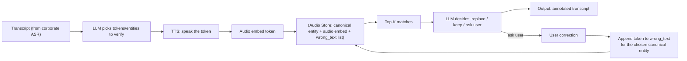

# Transcript Annotator With Audio RAG

## Goal 
Improve enterprise meeting transcripts (e.g., Teams) for domain-specific entities (jargon, project names, people, locations) without tuning or redeploying the transcription model.

## Why this exists
Corporate transcription services are generally strong at common vocabulary, but frequently miss:

- internal project codenames
- product acronyms
- uncommon proper nouns (people, sites, tools)
- org-specific jargon

Most vendors don’t expose a practical way to fine-tune the underlying ASR model—standing up a custom ASR pipeline is expensive and operationally heavy.

## The approach
Instead of tuning ASR, we build a RAG-based audio annotator:

- Mine corporate documents → extract entity names (NER)
- Generate synthetic audio for each entity via TTS
- Embed the audio and store it alongside entity text + optional summary
- After a meeting transcript is produced:

    - re-extract transcript entities (NER)
    - identify and embed uncertain entities
    - retrieve top matches from the audio store
    - decide: keep / correct / ask the user

If user corrects: store (wrong text → correct entity) feedback to improve future auto-corrections

## Architecture Overview

